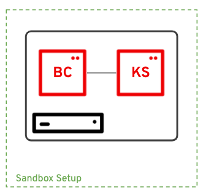

# RHPAM Installation and Configuration with Ansible

A playbook to install Red Hat Process Automation Manager Installation and configuration with Ansible in multiple configurations.

## Prerequisites

- A MacOSX or Red Hat (RHEL, CentOs, Fedora ...) type hosts
- An account at access.redhat.com
- Check out the variables in [all.yml](all.yml) for package versions.
- Assign hosts to the right group in the [hosts](hosts) inventory file.

## RHPAM Setup flavors

### RHPAM Sandbox

Business Central and Kie Server on the same host with a managed Kie Server runtime mode



```
ansible-playbook -i hosts pam-sandbox.yml
```

## Kudos & Inspirations

- [Ansible JBoss BxMS Role](https://github.com/redhat-cop/jboss_bxms)
- [Red Hat Process Automation Manager Ansible Installation](https://github.com/juliaaano/rhpam-eap-ansible)
- [Victor da Costa](https://github.com/victorock)
